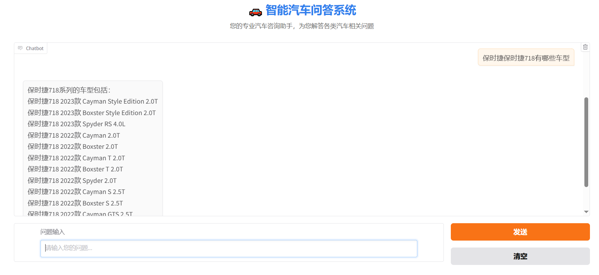
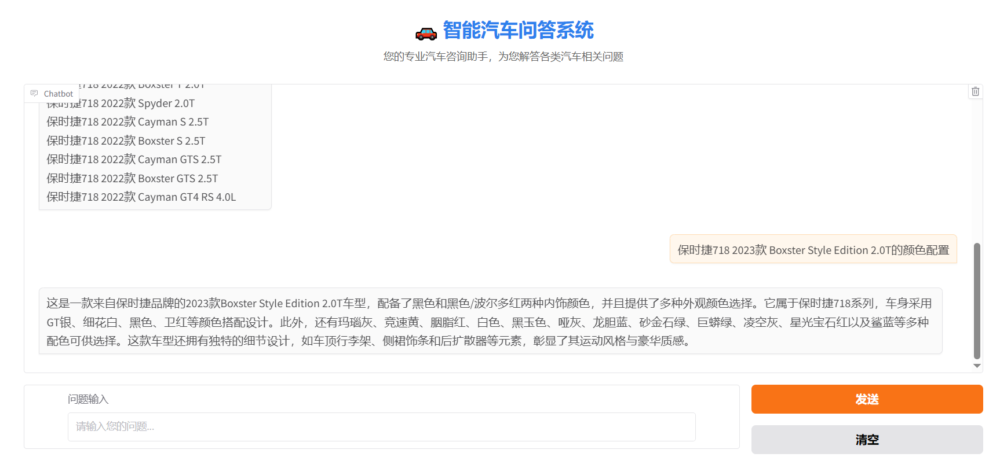

# 📖 项目简介
本项目构建了一个结合知识图谱、**向量语义检索（FAISS）与大模型（Qwen-llm1.5-1.8B + LoRA 微调）**的车辆领域智能问答系统。 系统可支持车辆参数查询、车型对比、模糊匹配、自然语言回答生成等功能，提升了汽车垂直场景下的用户问答体验与智能化程度。

# 🧠 项目亮点
✅ 构建汽车知识图谱，结构化管理车型数据

✅ 使用 FAISS 实现实体模糊匹配与语义召回

✅ 基于 SentenceTransformer 提取语义向量（Top-1 匹配准确率达 90%）

✅ 使用 LoRA 对 Qwen-llm1.5-1.8B 模型进行指令微调，增强车辆问答能力

✅ 支持 JSON 格式三元组提取 + Neo4j 查询模板驱动

✅ 支持自然语言问答生成，提升交互人性化体验

# 🔧 系统架构
- 用户输入问题

- 三元组信息提取（jieba + 大模型 prompt提取）

- 模糊实体匹配（SentenceTransformer + FAISS）

- 构造查询语句（Neo4j 模板）

- 图谱结果返回

- 微调大模型生成自然语言回答

- 输出最终回答 

# 📂 项目结构
project/  
├── data/     `#车辆原始数据`    
├── logs/     `# 日志文件`   
├── models/  `# 模型路径`    
├── TextVector/ `# 向量数据处理`  
├── otherDeal/  `# 其他处理文件路径`  
├── spiders/    `# 爬虫处理`  
├── webs/   
│   ├── QA_st_web.py.py  `# streamlit运行文件`    
│   ├── QA_web.py.py    `# gradio运行文件`   
├── train/ `# 微调代码`   
└── README.md           `# 项目说明文档`  

# 💻 示例输入输出
## 文本示例
- 输入问题：  
  - 奔驰E级 2025款 改款 E 300 L 尊贵运动型的基本信息

- 输出问题：  
  - 这是一款来自北京奔驰的中大型豪华轿车，配备了9挡手自一体变速箱和2.0升涡轮增压四缸发动机。它的车身结构为4门5座三厢设计，并且在2025年3月才正式推出。
该车的最大扭矩达到400牛米，最大功率可达190千瓦，在最高车速下能达到每小时245公里。其整备质量为1930千克，符合国VI排放标准，并且采用汽油加48V轻混系统的动力总成。
这款奔驰E级在性能上表现出色，其搭载了258马力的2.0升L4发动机，并且在WLTC工况下的综合油耗仅为每百公里6.5升。此外，它还提供三年不限公里的整车质保服务以及高达2520公斤的最大满载质量。这款车的价格定位在59.98万元左右，属于中大型车系列。

## 运行示例

# 🔍 项目应用场景
🚗 智能汽车销售问答助手

📱 垂直领域车企客服系统

📊 车主辅助决策平台

🤖 大语言模型在专业知识图谱场景中的部署模板

# 📈 未来优化方向
增强多轮问答与上下文理解能力

引入 Agent 流程，实现复杂任务链式调用

增加推荐引擎模块，支持条件推荐/对比分析

优化三元组提取准确率，使用多策略融合模型

# 🙌 致谢
本项目使用以下开源工具与框架：

[Transformers](https://github.com/huggingface/transformers)

[PEFT](https://github.com/huggingface/peft)

[FAISS](https://github.com/facebookresearch/faiss)

[Neo4j](https://neo4j.com/)

[SentenceTransformers](https://www.sbert.net/)